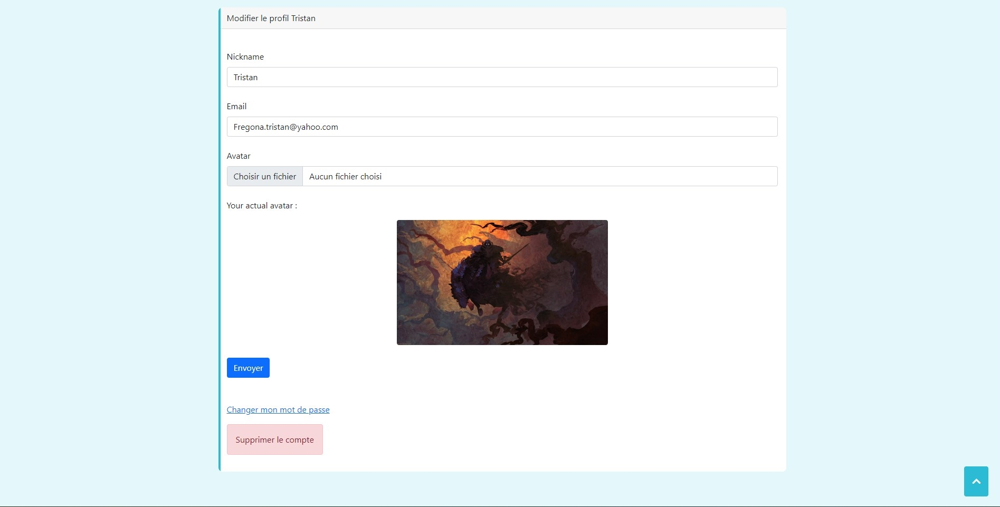
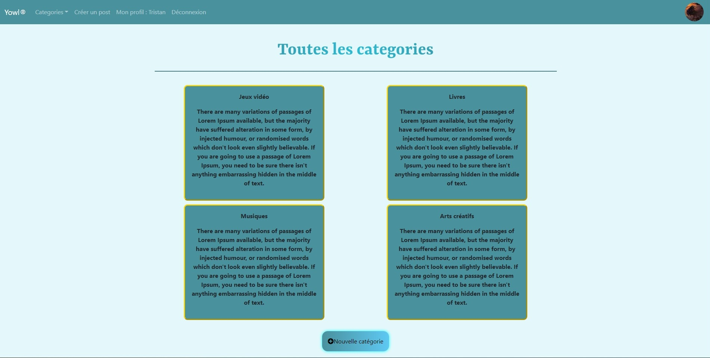
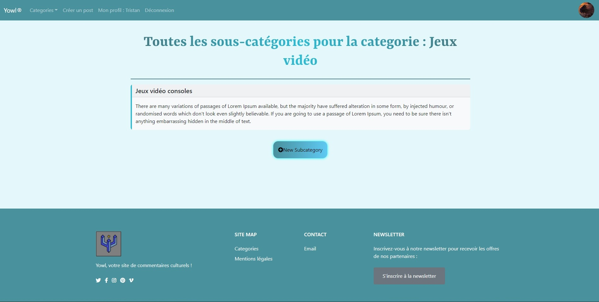

# YOWL

## Project setup

### Database 

Run your server (Wamp, Xampp) and create a database 'yowl'

### In the repo 
```
npm install
```

### Run the web app 
```
php artisan migrate
```

### Run the web app 
```
php artisan serve
```

## Web App Preview

### Home page

Display some categories and the last comments <br>
All the 'read' part of the application is accessible for non-connected users

<p align="center">
  
</p>

### Sign up

Form for inscription 

<p align="center">
  
</p>

### Sign in

Form for inscription with a search in the data base for the user

<p align="center">
  
</p>
<p align="center">
  
</p>

The user is logged so he can log out now in the navbar

### Profile page

Different if the user connected is an admin or not

<p align="center">
  
</p>
<p align="center">
  
</p>

### Update the profile

Form for update user profile 

<p align="center">
  
</p>

### Admin CRUD

Page only accessible for admin users where they can see, create, update, delete anything

<p align="center">
  
</p>

### Update form

Form for update a content 

<p align="center">
  
</p>

### Navigation to see the posts

Page where all categories are display 

<p align="center">
  
</p>

When the user clicks on a category, he is diricted on the subcategories

<p align="center">
  
</p>

And finally posts that are in this subcategory 

<p align="center">
  
</p>

Page for each post with related comments and if the user is logged, the possibility to comment

<p align="center">
  
</p>

### Posting a subject

Firstly the user need to choose the category of his futur post 

<p align="center">
  
</p>

Firstly the user need to choose the category of his futur post 

<p align="center">
  
</p>

And then the form 

<p align="center">
  
</p>